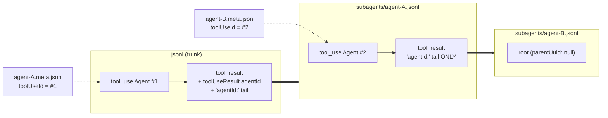

# Agents

> See [application_model.md](application_model.md) for the system overview.

`claude-code-log` renders four flavors of spawned agents:

| Flavor | Trigger | Reference |
|--------|---------|-----------|
| **Sync sub-agent** | `Task` tool_use, default behavior | This doc § 1 (#79, stub) |
| **Async task agent** | `Task` with `run_in_background=True` | This doc § 2 (#90) |
| **Teammates** | `Agent` (or `Task` with `team_name`/`name`); requires `CLAUDE_CODE_EXPERIMENTAL_AGENT_TEAMS=1` | [teammates.md](teammates.md) (#91) |
| **Workflow sub-agents** | `Workflow` tool_use (JS orchestrator fan-out) | [workflows.md](workflows.md) (#174); summary in § 4 |

Any of the Task/Agent flavors may itself spawn sub-agents (Claude Code
2.1.172+) — § 5 covers how the nesting is discovered and rendered.

The first three share the same metadata-tail shape on the spawn's tool_result
(`agentId:` line + optional `<usage>` block) — `parse_agent_result_metadata`
populates `TaskOutput.metadata` for every variant. Workflow sub-agents are
different: their metadata comes from the run's `journal.jsonl` +
`<runId>.json` snapshot, not from the tool_result tail.

## 1. Sync sub-agents (#79)

The default `Task` flavor: synchronous, sidechain entries from
`subagents/agent-<id>.jsonl` are spliced under the trunk tool_result by
`_relocate_subagent_blocks`, the agent's final answer surfaces at the
spawn position via `_cleanup_sidechain_duplicates` (drops the duplicate
last sub-assistant from the sidechain so the answer doesn't appear
twice).

Issue [#79](https://github.com/daaain/claude-code-log/issues/79)
captures the remaining work — the prompt-hash fallback in
`converter.py` is teammates-specific and would need a different
normalization for plain user-text first entries on sync sub-agent
files.

## 2. Async task agents (#90)

When the assistant emits `Task` with `run_in_background=True`, Claude
Code returns immediately with an "Async agent launched successfully…"
stub on the tool_result. The agent runs in a background subagent
session; the assistant can poll explicitly via the `TaskOutput` tool;
some time later, Claude Code injects a synthetic User entry whose
`message.content` is a raw `<task-notification>…</task-notification>`
block carrying the agent's final answer.

### 2.1 Pipeline shape

The same agent surfaces in the trunk transcript across **four**
distinct entries — three rendered cards and one user-text entry that
parses into a structured card:

```
Task tool_use            ←── 🔧 Task: "Coverage analysis" [async]
                              └── input.run_in_background = True
Task tool_result         ←── content.output is TaskOutput
                              ├── result = "Async agent launched successfully…\n
                              │            agentId: <id>\noutput_file: …"
                              ├── metadata.agent_id = <id>
                              └── async_final_answer = <fold target>   (Phase 3)
…
TaskOutput tool_use      ←── 🔍 TaskOutput #<id>
                              └── input is TaskOutputInput { task_id, block, timeout }
TaskOutput tool_result   ←── content.output is TaskOutputResult
                              ├── retrieval_status, task_id, task_type, status
                              └── output_truncated, output_file
                                  (the truncated transcript body is parsed
                                   for the marker and discarded — the agent's
                                   full transcript already renders inline as a
                                   sidechain, and the answer reaches the trunk
                                   via the notification below)
…
<task-notification> user ←── 🔄 Async result · *summary*
                              └── content is TaskNotificationMessage
                                    └── result_text = <fold source>   (Phase 3)
```

### 2.2 The two `TaskOutput` names

There are two unrelated dataclasses with `TaskOutput` in the name. They
attach to different tool_results:

| Class | Attached to | Holds | Defined |
|-------|-------------|-------|---------|
| `TaskOutput` | The `Task` tool_result | `result` (launch stub or final answer text), `metadata` (`agent_id`, `worktree_path`, `<usage>`), and the new `async_final_answer` field | `models.py` |
| `TaskOutputResult` | The `TaskOutput` polling tool's tool_result | `retrieval_status`, `task_id`, `task_type`, `status`, `output_truncated`, `output_file` | `models.py` |

The "fold" (Phase 3) writes into `TaskOutput.async_final_answer` —
i.e. the **Task tool_result's** parsed output, not the polling tool's
result. The polling tool's `<output>` body (a truncated snapshot of the
agent's transcript) is parsed only for its truncation marker and
deliberately discarded.

### 2.3 The fold (Phase 3)

`_link_async_notifications` in `renderer.py` runs after pair
identification and tree building. For every Task tool_result whose
`metadata.agent_id` matches a `TaskNotificationMessage.task_id`, it:

- **Spawn-fold (FULL/HIGH/LOW):** sets
  `tool_result.output.async_final_answer = notification.result_text`
  and flags `notification.result_is_duplicate = True`. The
  formatter then renders a "Result (from async notification)"
  collapsible below the launch stub on the spawn card, and reduces
  the notification card to a backlink stub. Sourcing the fold from
  the notification (not from the sidechain assistant) is what makes
  the fold survive at LOW where sidechain entries are stripped
  pre-render.
- **Sidechain dedup (FULL/HIGH only):** when the last sub-assistant
  text matches the notification's `result_text`, drops the duplicate
  from the sidechain tree. No-op at LOW (sidechain already gone).

At `DetailLevel.LOW` the format-specific renderers honor the flag
by **ghosting** the duplicate notification — `format_TaskNotificationMessage`
and `title_TaskNotificationMessage` (in both `HtmlRenderer` and
`MarkdownRenderer`) return `""` when `self.detail == LOW and
content.result_is_duplicate`. The rendering loop's existing
"skip empty messages" elision (HTML's
`if title or html or msg.children:` and Markdown's
`_render_message` returning `""` for no-title-no-content) drops the
card from the visible output. The notification stays in
`ctx.messages` with its original `message_index`, so ancestry classes
(`d-N`), backlink fields (`spawning_task_message_index`,
`SessionHeaderMessage.parent_message_index`), and session navigation
anchors all stay valid — no index-remap cascade required.

### 2.4 Detail-level matrix

| level     | spawn-fold visible | notification card | answer visible |
|-----------|--------------------|-------------------|----------------|
| full      | yes                | yes (collapsed body, full metadata) | yes (folded) |
| high      | yes                | yes (collapsed body, full metadata) | yes (folded) |
| low       | yes                | dropped                             | yes (folded) |
| minimal   | no (Task tool_result filtered) | yes (body kept) | yes (notification body) |
| user-only | no (Task tool_result filtered) | yes (body kept) | yes (notification body) |

The answer is visible exactly once at every detail level. At
MINIMAL/USER_ONLY the spawn-fold is skipped (the Task tool_result
itself is ghosted by `_ghost_template_by_detail`), so the
notification card retains its body as the surviving copy.

### 2.5 Key files

- `models.py` — `TaskOutputInput`, `TaskOutputResult`,
  `TaskNotificationMessage`, `TaskNotificationUsage`. The
  `async_final_answer: Optional[str]` field on `TaskOutput`.
- `factories/task_notification_factory.py` — parses
  `<task-notification>` user content.
- `factories/tool_factory.py` — `parse_taskoutput_output` for the
  polling tool's body.
- `factories/user_factory.py` — dispatch hook before teammate
  detection.
- `renderer.py` — `_link_async_notifications`,
  `_async_agent_id_from_tool_result`, `_last_sidechain_assistant`.
- `html/async_formatter.py` — notification card HTML +
  TaskOutput poll card HTML.
- `html/renderer.py::HtmlRenderer.format_TaskNotificationMessage` /
  `title_TaskNotificationMessage` — return `""` at LOW for
  duplicate-flagged notifications (ghost mechanism).
- `html/tool_formatters.py::format_task_output` — renders
  `async_final_answer` as a collapsible below the launch stub.
- `markdown/renderer.py::MarkdownRenderer.format_TaskNotificationMessage` /
  `title_TaskNotificationMessage` — same ghost-at-LOW gate.
  Plus `format_TaskOutput`, `format_TaskOutputResult`, and titles.
- `html/utils.py::CSS_CLASS_REGISTRY` —
  `TaskNotificationMessage: ["user", "task-notification"]` so the
  runtime "User" filter toggle keeps the card visible at FULL/HIGH.

### 2.6 Test fixture

`test/test_data/async_agents/eb000000-…` — a 7-entry main session +
3-entry sidechain sliced from the canonical clmail-monk transcript.
Exercises all four shapes (Task with `run_in_background`,
async-launched tool_result, TaskOutput poll, `<task-notification>`).
The notification's `<result>` matches the last sub-assistant verbatim
so the Phase 3 fold + dedup fires.

Tests live in `test/test_async_agents.py` (parser unit tests, factory
dispatch, rendering pipeline assertions, detail-level invariants —
including the LOW regression guard for the fold).

## 3. Teammates (#91)

A teammate is a `Task` (or `Agent`) spawned with `team_name` and a
human `name`, paired with a long-running team coordinator. The
teammates feature stacks specialized behavior on top of the sub-agent
machinery:

- A registry of six teammate-management tools (`TeamCreate`,
  `TaskCreate`, `TaskUpdate`, `TaskList`, `SendMessage`,
  `TeamDelete`).
- `<teammate-message>` blocks in user content.
- Per-session teammate color propagation through `RenderingContext`.
- Session-header team badge and project-index team aggregation.

See [teammates.md](teammates.md) for the full as-built reference.

## 4. Workflow sub-agents (#174)

A `Workflow` tool_use launches a JavaScript orchestrator that fans out
into many side-channel sub-agents grouped into phases. Unlike the Task
flavors above, these agents are *not* integrated through
`_integrate_agent_entries` / `_relocate_subagent_blocks`: the whole run
(phases → agents → each agent's side-channel transcript) is parsed from
`<sid>/subagents/workflows/<runId>/` by `workflow.py` and spliced as a
self-contained sub-tree at the Workflow tool_use site by
`_splice_workflow_runs` — the last pass in
`generate_template_messages`. Each agent's transcript is re-rendered
through a nested `generate_template_messages` call and grafted under
its `workflow_agent` card.

See [workflows.md](workflows.md) for the full as-built reference
(on-disk layout, parse model, taskId linkage, splice mechanics,
detail-level behaviour).

## 5. Nested agent hierarchies (#213)

Claude Code 2.1.172+ lets sub-agents spawn their own sub-agents. The
announced "up to 5 levels deep" cap is **not enforced** (a linear chain
was observed at depth 79), so nothing in the pipeline assumes a bound.
(The *practical* bound is Python's ~1000-frame recursion limit — the
loader's child loading, the block relocation and the depth chase all
recurse one frame per level; a pathological multi-hundred-depth chain
would fail as a RecursionError at load.)

### 5.1 On-disk shape

The layout stays FLAT at every depth: each agent gets
`<sid>/subagents/agent-<id>.jsonl` + `agent-<id>.meta.json` next to its
siblings — nesting never creates subdirectories. Every entry of every
agent file carries the *trunk* `sessionId`, `isSidechain: true` and
`agentId` = the agent's own id; the root entry has `parentUuid: null`.

The cross-file links differ by direction:

- **parent → child**: the in-band metadata tail on the spawning
  tool_result's content (`agentId: <id> (use SendMessage …)` +
  `<usage>`). At trunk level the structured `toolUseResult.agentId`
  additionally exists — *only* there; nested tool_results carry no
  `toolUseResult`.
- **child → parent**: the sidecar `meta.json`'s `toolUseId` names the
  spawning tool_use. Crucially this survives spawns that never returned
  (an interrupted spawn's tool_result is a generic `is_error` stub with
  no tail).



### 5.2 Discovery and linking (`spawnedAgentId`)

`load_transcript` scans the sidecars once per load (memoized per
directory) into `{toolUseId → agentId}` and, for every spawning
tool_use found in the loaded entries, stamps the resolved id on the
spawning tool_result entry (or the tool_use's assistant entry when no
result exists) as the synthetic **`spawnedAgentId`** field — see
`_subagent_meta_map` / `_apply_subagent_meta_links` (converter.py).

The field exists because `agentId` can't carry both meanings: inside an
agent transcript `agentId` is *membership* (whose transcript the entry
belongs to), while the spawn anchor needs a *reference* (which agent
this entry spawned). The legacy trunk backpatch (copying
`toolUseResult.agentId` into the entry's `agentId`) only worked because
trunk entries have no membership.

Downstream, `spawnedAgentId` anchors take precedence everywhere the
legacy reference was used: `_integrate_agent_entries` (DAG re-parenting
+ `{trunk}#agent-{id}` stamping — flat synthetic sids stay
collision-free at any depth), the converter's insert-at-point-of-use
pass, and `_relocate_subagent_blocks` (renderer.py), which now emits
blocks recursively so a nested agent's block lands right after its
spawn entry *inside* its parent agent's block.

### 5.3 Hierarchy levels

`_get_message_hierarchy_level`'s sidechain levels (assistant 4 / tools
5) are the depth-1 block; `_build_message_hierarchy` shifts a
depth-`d` transcript by `2 * (d - 1)`, chasing depth through the
`spawned_agent_id` links (agent lines without one default to depth 1 —
legacy data renders exactly as before). Each nesting level therefore
adds two DOM levels: the spawn pair, then the child transcript.

The sidechain dedup (`_cleanup_sidechain_duplicates`) applies per spawn
node at any depth: a transcript whose prompt and final answer both
round-trip verbatim through its spawn pair collapses entirely — a
trivial leaf shows nothing beyond its parent's tool_use/tool_result
pair, exactly like depth-1 sync agents.

### 5.4 Fixture

`test/test_data/nested_agents/` (generated by
`scripts/gen_nested_agents_fixture.py`): a 2×2 fan-out, a 3-deep chain,
and an interrupted spawn linkable only via its sidecar. Pinned by
`test/test_nested_agents.py`.
