# DAG-Based Message Architecture

> See [application_model.md](application_model.md) for the system overview.

Message ordering is derived from the `parentUuid` → `uuid` graph recorded in
the transcript JSONL — not from timestamps. The graph is the authoritative
structure; timestamps are metadata, used only to merge parallel chain
segments, order sibling sessions, and disambiguate fork artifacts. This is
what lets resumed sessions, rewinds, compaction replays, subagents, and
parallel tool flows all render in a coherent order that timestamp sorting
cannot express.

Background reading: [Messages as Commits: Claude Code's Git-Like DAG of
Conversations](https://piebald.ai/blog/messages-as-commits-claude-codes-git-like-dag-of-conversations)

All graph code lives in `claude_code_log/dag.py`. The entry point is
`build_dag_from_entries(entries)`, which runs the four construction steps in
sequence (index → DAG → session DAG-lines → session tree);
`traverse_session_tree(tree)` then yields the final linear entry order that
feeds the rendering pipeline.

---

## Core Concepts

### The DAG

Every message has a `uuid` and a `parentUuid` (null for first messages).
Together they form a directed acyclic graph.

### Sessions and DAG-lines

A **session** is the set of messages sharing a `sessionId`. Each session
forms a single contiguous chain in the DAG — its **DAG-line**. A session's
DAG-line contains only the messages unique to that session (after
deduplication).

Within a session, the trunk `parentUuid` chain is linear after artifact
linearization. Only explicit user rewinds create within-session forks,
rendered as branch pseudo-sessions; every other multi-child shape is a
recording artifact that gets linearized — see
[Fork Disambiguation](#fork-disambiguation-the-linearization-ladder).

### Junction Points

A **junction point** is a message whose `uuid` is referenced as
`parentUuid` by messages from **different sessions**. This is where
resume/fork happens.

Junction points are **annotations on messages**, not splits of DAG-lines.
A session's DAG-line remains intact; the junction point simply records
"session N forks/continues from here."

### Session Tree

Sessions form a tree:

- **Root sessions**: Their first message has `parentUuid: null` (or points
  to a message not in any loaded session, e.g. after a `/clear`)
- **Child sessions**: Their first unique message's `parentUuid` points into
  a parent session's DAG-line

Children are ordered chronologically (by their first message's timestamp).

Example:

```
Session 1: a → b → c → d → e → f → g
                             ↑           ↑
                             |           |
Session 3: k → l → m        Session 2: h → i → j
(fork from e)                (continues from g)
```

Session tree:
```
- Session 1
  - Session 2 (continues from g)
  - Session 3 (forks from e)
```

Rendered message sequence (depth-first, chronological children):
```
s1, a, b, c, d, e, f, g, s2, h, i, j, s3, k, l, m
```

Where `s1`, `s2`, `s3` are synthesized session header messages.

Beyond the session structure, the `SessionTree` dataclass (in
[`dag.py`](../claude_code_log/dag.py)) also ferries **dynamic-workflow
data** from the loader to the renderer: `workflow_runs` (parsed
`WorkflowRun`s keyed by runId) and `workflow_links` (the
full-session-scope `{tool_use_id: WorkflowRun}` map resolved before
pagination). Both are populated by `converter.py` and consumed by the
renderer's link/splice passes — see [workflows.md](workflows.md).

### Navigation Links

- **Forward links** on junction points: "Session N forks/continues here"
  (shown on message `e` and `g` in the example above)
- **Backlinks** on session headers: "Continues from message X in Session Y"
  (shown on `s2` and `s3`)

> Where branch / session header *titles* (the `Branch • <uuid8> •
> <preview>` text) are assembled is a renderer concern, not a DAG
> concern. See the `SessionHeaderMessage` glossary entry in
> [application_model.md](application_model.md#4-cross-cutting-glossary)
> for the functions involved (`_branch_label`, `_build_branch_header`,
> `create_session_preview`, `simplify_command_tags`).

Backlinks use `#msg-d-{N}` anchors — sequential indices assigned during
rendering. They are stable within a single render pass (the combined
transcript is always regenerated whole) but shift when any session grows,
so they only work where all links and targets are on the same page.
Individual session pages have independent indices; if cross-page links
into another session's page are ever needed, they will require stable
UUID-based anchors (`msg-{uuid}`) instead.

### Deduplication

When session 2 resumes session 1, Claude Code may replay prefix messages
(d', e', f', g') into session 2's file. These duplicates share the same
`uuid` but have a different `sessionId`.

Resolution: deduplicate by `uuid`, keeping the instance from the
**earliest session** (by first message timestamp). The "new" messages in
session 2 (those with previously-unseen `uuid`) form its DAG-line.

### Agent Transcripts

Subagent transcripts live in `<session>/subagents/agent-*.jsonl` with
`parentUuid: null` on their first entry. Before the DAG is built,
`_integrate_agent_entries` (converter.py) makes two adjustments per agent:

1. **Re-parent** the agent's root to the trunk entry whose `agentId`
   references this agent (the spawning Task/Agent `tool_result`). Nested
   spawns (agent A spawns agent B) anchor inside A's sidechain; a
   cross-agent-boundary guard prevents an agent's own root from acting as
   its anchor (which would self-loop).
2. **Stamp** every entry of the agent with a synthetic session id,
   `{trunk}#agent-{agentId}`, so each agent becomes its own DAG-line that
   attaches at the anchor — rather than folding into the trunk's chain.

With both in place, agents fall out of the normal session-tree machinery:
no special-casing in the walk or the traversal. Per-agent-type linking
details (sync, async, teammates) are covered in [agents.md](agents.md)
and [teammates.md](teammates.md).

---

## Pipeline

### Step 1 — Index (`build_message_index`)

Parse all entries, index by `uuid` (oldest instance wins on duplicates),
group by `sessionId`:

```python
messages_by_uuid: dict[str, MessageNode]   # uuid → node (oldest wins)
children_by_uuid: dict[str, list[str]]     # parentUuid → [child uuids]
sessions: dict[str, list[str]]             # sessionId → [uuids]
```

### Step 2 — DAG construction (`build_dag`)

Populates `children_uuids` in three steps that **must run in this order**:

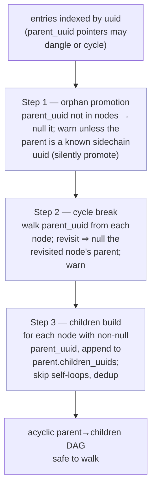

Steps 1 and 2 mutate `parent_uuid` on the input nodes (they're one-way: a
promoted-to-root node can't recover its dangling parent later). Step 3 is
the only step that builds the `children_uuids` lists. Doing children first
would propagate any cyclic edge into the children graph, and downstream
walks via `children_uuids` would loop forever — so cycles must be broken
at the parent-pointer layer before children are materialised.

### Step 3 — Session DAG-lines (`extract_session_dag_lines`)

For each session:

1. Identify the session's unique messages (those whose authoritative
   `sessionId` matches).
2. Find roots (nodes whose `parent_uuid` is null or points outside the
   session). A session may have **multiple roots** — see
   [Compact Boundaries and Multi-Root Sessions](#compact-boundaries-and-multi-root-sessions).
3. Walk each root via `_walk_session_with_forks`, following same-session
   children. Single child → chain continues. Multiple same-session
   children → the [linearization ladder](#fork-disambiguation-the-linearization-ladder)
   decides between artifact (linearize) and real fork (branch).
4. Merge trunk DAG-lines (`session_id == sessionId`) from all roots — and
   any trunk *segments* produced by continuation-fork linearization — into
   a single chain ordered by `first_timestamp`; branch DAG-lines stay
   separate under synthetic ids (`{sessionId}@{uuid12}`).
5. **Coverage check**: `walked ∪ skipped` must equal the session's node
   set; otherwise fall back to a timestamp sort for the whole session and
   log a warning. (`skipped` collects nodes intentionally dropped by the
   ladder — replay chains, dead-end descendants — so legitimate
   linearization doesn't trip the fallback.)

**Defence-in-depth in the walker**: even though `build_dag` breaks
parent-pointer cycles before populating `children_uuids`, a future bug or
hand-edited fixture could reintroduce a cyclic edge *after* DAG
construction. `_walk_session_with_forks` keeps a `walk_visited` set across
the whole queue-driven walk; a uuid visited twice truncates the chain at
that point with a warning. The build-time cycle break and this walk-time
guard together rule out the unbounded-loop class of hangs.

### Step 4 — Session tree (`build_session_tree`)

1. For each session, find where its DAG-line attaches: walk back from the
   session's first unique message via `parentUuid`; the first message
   belonging to a **different** session is the attachment point.
2. The session owning the attachment point is the parent session. Root
   sessions have no attachment point.
3. Children are ordered chronologically.
4. Junction points are annotated: a message is a junction point if its
   children include messages from a different session. The annotations
   drive forward-link rendering.

### Handoff to rendering

`traverse_session_tree` flattens the tree depth-first into the final
entry order. Downstream processing (pairing, hierarchy, tree building)
lives in `renderer.py` and operates on that order. Pairing is keyed by
`(session_id, tool_use_id)`, so pairs never span sessions. One pairing
rule exists specifically to preserve DAG order — see the
[assistant-continuation rung](#5-assistant-continuation-tool-flow-_is_continuation_fork)
below.

---

## Fork disambiguation: the linearization ladder

A node with multiple same-session children is either a **real fork** (the
user rewound the conversation) or one of several **recording artifacts**
that must be linearized. `_walk_session_with_forks` tries the following
checks in order; the first match wins. Only a shape that survives every
rung is treated as a real fork.

| # | Rung | Detection | Action |
|---|------|-----------|--------|
| 1 | [Structural side-branch collapse](#1-structural-side-branch-collapse) | ≥1 structural child (Passthrough/Attachment with structural subtree), ≤1 non-structural child | Stitch structural children in chronologically; continue via the non-structural child (or end) |
| 2 | [Stitch V1 — structural tool_result](#2-tool-result-stitching-variant-1-structural-tool_result) | Every user child's subtree is structural; exactly one assistant child | Splice user children ahead of the assistant continuation |
| 3 | [Stitch V2 — dead-end continuation](#3-tool-result-stitching-variant-2-dead-end-continuation) | Every assistant child's subtree dead-ends; exactly one user child continues | Splice dead-end children ahead of the continuing user child |
| 4 | [Live passthrough chain (V3)](#4-live-passthrough-chain-variant-3) | Exactly one passthrough child has a live subtree; all other children structural | Stitch the structural siblings in; continue through the live passthrough |
| 5 | [Assistant continuation](#5-assistant-continuation-tool-flow-_is_continuation_fork) | Assistant parent with tool_use(s); children = assistant continuation(s) + tool_result(s) addressed to the parent's own tool ids | End chain; re-enqueue each child as a trunk *segment*; timestamp merge re-links them |
| 6 | [Compaction replay](#6-compaction-replay) | All children share one timestamp | Follow the first child; skip the replays |
| 7 | [Real rewind](#7-real-rewind-branch-pseudo-sessions) | None of the above (different timestamps) | Fork: each child becomes a branch pseudo-session |

Diagram conventions: "recorded" shows the DAG as written to JSONL (the
shape that *looks like* a fork); "linearized" shows the resulting chain.
Blue = structural entries, red = dead ends (descendants dropped to
`skipped`), green = live continuation.

### Helper predicates

- **`_is_structural_subtree(uuid)`** — true when the node's *descendants*
  (the root itself is not inspected) contain no user/assistant entries —
  only passthrough/attachment material (hook callbacks, `progress`
  chains, …). Unbounded traversal (bounded by the session's uuid set):
  real `progress` chains regularly run more than 20 entries deep, so a
  depth cap would misclassify pure-passthrough tails as live.
- **`_is_subtree_dead_end(uuid)`** — true when every path in the subtree
  terminates within depth 20. A subtree deeper than the cap is assumed
  **live** ("too deep to tell"). This is why a deep `max_tokens`
  continuation chain is *not* a V2 dead end and falls through to rung 5.
- **`_is_continuation_fork(parent, children)`** — true when the parent is
  an assistant entry carrying `tool_use` block(s) and every child is
  either an assistant entry (the continuation) or a user entry whose
  content is exclusively `tool_result` blocks addressed to the parent's
  own tool ids. A user child with *typed text* (a rewind prompt) or a
  `tool_result` for some other tool id fails the predicate — those are
  real forks. Both an assistant child and a tool_result child must be
  present.
- **`_StructuralEntry`** = `PassthroughTranscriptEntry` (legacy
  unknown-but-DAG-relevant types: `progress`, `agent-setting`, `pr-link`,
  `ai-title`) + `AttachmentTranscriptEntry` (typed `attachment` entries:
  hook callbacks, deferred-tool deltas, queued commands, …). Both are
  treated uniformly here.

### 1. Structural side-branch collapse

A structural entry alongside a regular sibling is an artifact, not a
fork. The walker partitions children into `structural_kids` (structural
roots with structural subtrees) and `non_structural`, and collapses when
at most one non-structural child remains. Two shapes, one rule:

**Shape A — all-structural** (e.g. two hook attachments on one parent,
often at far-apart timestamps, so the replay heuristic would not apply):

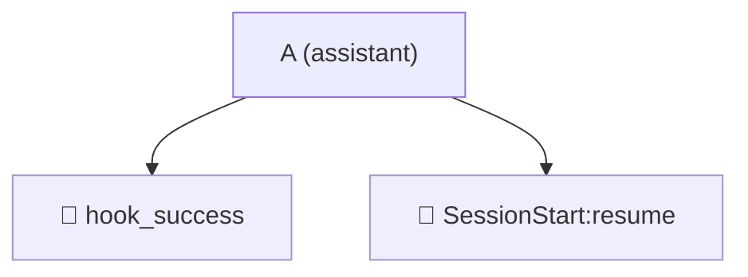

Linearized — both stitched in chronologically, chain ends:

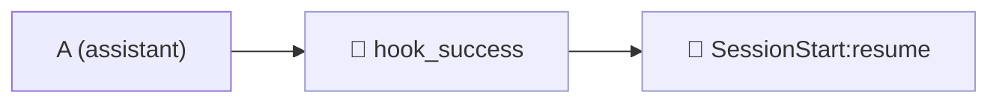

**Shape B — mixed**: a conversational child alongside a bare `progress`
leaf or chain. Without this rung it would fall through to the rewind path
and produce a spurious one-branch fork point.

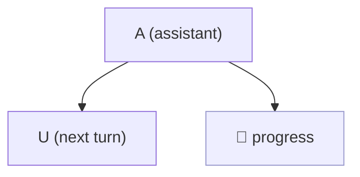

Linearized — the structural child is stitched in, the conversation
continues:

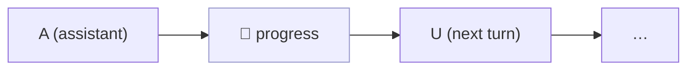

The partition is strict: only structural-typed roots with purely
structural subtrees qualify. A `UserTranscriptEntry` whose subtree is
passthrough-only (the V1 shape below) lands in `non_structural` and is
handled by `_stitch_tool_results` instead — the rungs don't overlap. And
if a future passthrough type ever carries conversational descendants, the
subtree check makes it fall through to the fork logic rather than masking
content.

### 2. Tool-result stitching, variant 1: structural tool_result

When the assistant makes **multiple tool calls in one turn**, the JSONL
can record the `tool_result` for the first call and the `tool_use` for
the second as *siblings*. The `tool_result` is conversation content, but
its subtree carries only structural callbacks (e.g. a `hook_success`
leaf) — the assistant sibling is the real continuation.

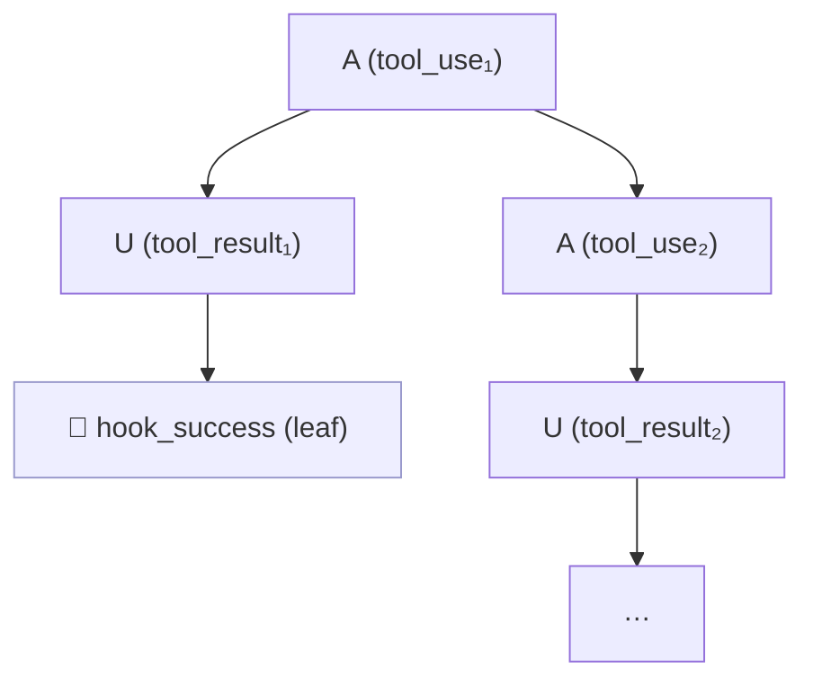

Linearized — the result is spliced ahead of the continuation; its
structural descendants go to `skipped`:

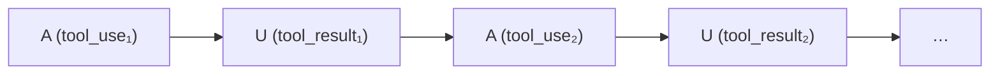

Detection: *every* user child has a structural subtree
(`_is_structural_subtree`), and there is exactly one assistant child.

### 3. Tool-result stitching, variant 2: dead-end continuation

Claude Code sometimes emits a second `tool_use` that terminates without
producing a continuation — a progress artifact. Here the `tool_result`
for the first call **does** continue the conversation, so the dead
`tool_use` subtree is spliced in before it.

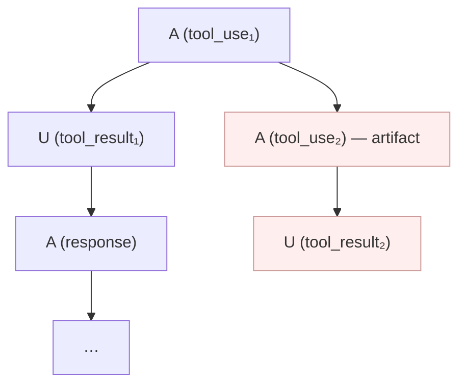

Linearized — the dead-end root is stitched in (its descendants go to
`skipped`), the user child continues the chain:

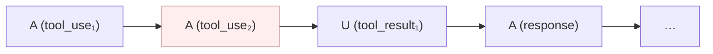

Detection: exactly one user child has a live continuation; every
assistant child's subtree dead-ends (`_is_subtree_dead_end`), as does
every other user child.

**Agent-anchor preservation**: parallel `Task`/`Agent` tool_uses emit
sibling tool_result anchors whose parent assistants sit in each other's
dead-end subtree. Before stitching, `_collect_agent_anchors` lifts two
kinds of nodes out of dead-end subtrees back into the chain: trunk
tool_results carrying an `agentId` (subagent attachment points) and
assistants carrying `Task`/`Agent` tool_use blocks (nested-spawn cards).
Without this, classifying the subtree as dead-end would detach the
subagent sessions and hide nested Agent invocations.

### 4. Live passthrough chain (Variant 3)

Recent Claude Code versions (observed 2.1.32+) thread parallel tool_uses
through `progress` passthroughs rather than direct `tool_use` siblings.
The passthrough subtree carries the live continuation; the
user(tool_result) sibling carries only structural callbacks.

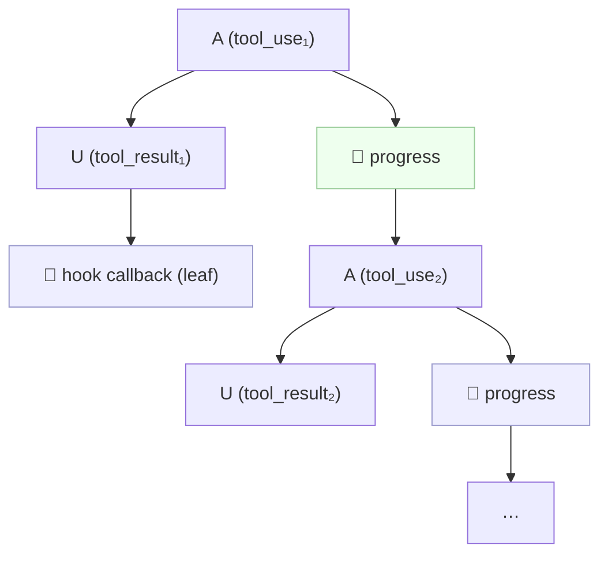

Linearized — structural siblings stitched in, the chain continues
*through* the live passthrough (which repeats the same shape at `A₂`):

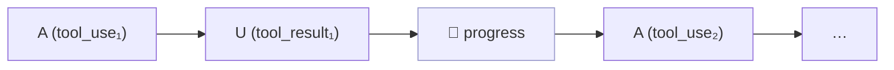

Detection: exactly one structural-typed child has a **non**-structural
subtree (the live one), and every other sibling has a structural subtree.
Rungs 2–3 don't fire here (no assistant sibling at this level); rung 1
doesn't fire (the live passthrough is not structural-subtree). Distinct
from real rewinds, which never include passthrough children.

### 5. Assistant continuation tool-flow (`_is_continuation_fork`)

The shape rungs 1–4 *cannot* catch: **both** siblings carry live
conversation. An assistant turn issues a `tool_use`, and the JSONL
records as siblings both the turn's **continuation** — a thinking block,
a `max_tokens` split, or the next parallel `tool_use` — and the
**lagging `tool_result`** (which arrives when the tool finishes, possibly
minutes later, and continues the conversation from there).

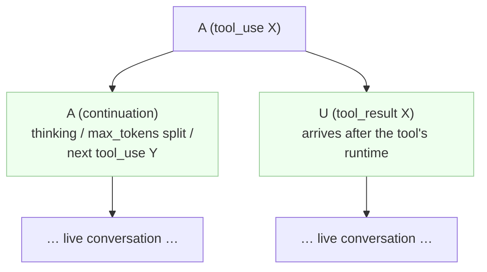

Both subtrees are live, so V1/V2 bail (each needs one side structural or
dead-end) and there is no passthrough for V3. Without this rung the walk
would read the shape as a rewind and fork — *recursively*, because each
continuation immediately hits the same shape at its own next tool call,
producing a staircase of spurious nested branches.

Linearized — continuation inline, lagging result after:

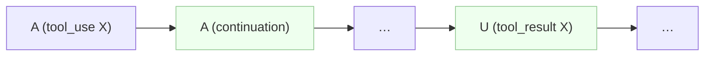

Mechanism — unlike rungs 1–4, nothing is stitched at the fork point.
The chain **ends** at `A₁` and each child is re-enqueued as a trunk
*segment* (same DAG-line id, not a branch). The trunk merge in
`extract_session_dag_lines` then concatenates all trunk segments by
`first_timestamp`: the continuation (issued within seconds) sorts before
the lagging tool_result. This reuses the multi-root merge machinery, so
arbitrarily deep repetitions of the shape flatten into one chain.

Discrimination from a real rewind: a rewind forks at new typed user
*prompts* (string content); here every user child consists exclusively
of `tool_result` blocks addressed to the parent's own `tool_use` ids.
Anything else — typed text, a result for a foreign tool id, any other
child type — fails the predicate and falls through.

**Renderer complement** — DAG order alone isn't enough: the renderer's
pair-reordering (`_reorder_paired_messages`) normally pulls each
`tool_result` adjacent to its `tool_use`, which would yank the lagging
result back *across* the continuation. `_identify_message_pairs`
(renderer.py) therefore skips marking the pair when assistant
continuation content (prose or thinking — `_is_continuation_content`)
sits between the two in linear order, so the result keeps its
chronological place. Sibling tool messages (parallel batches),
sidechain/subagent threads, and empty splits don't block pairing. At
reduced detail levels the ghost pass runs *before* pairing, so once the
continuation is filtered out the pair re-forms and renders adjacent —
the compact view wanted there. Pinned by `test_continuation_fork.py`
(DAG side) and `test_continuation_pairing.py` (renderer side).

### 6. Compaction replay

When Claude Code compacts context, it **replays** the conversation from
some point with **new UUIDs** but the **same `parentUuid` and timestamp**
as the originals — structurally identical to a rewind, semantically a
replay.

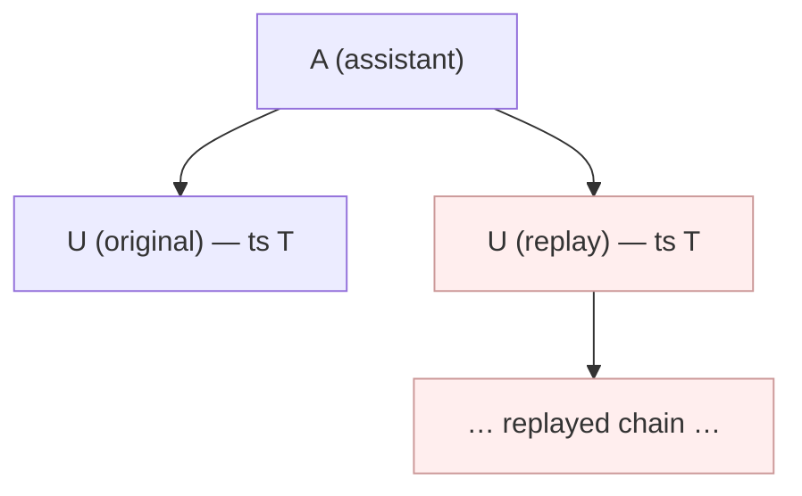

Linearized — follow the first child only; replay chains go to `skipped`:

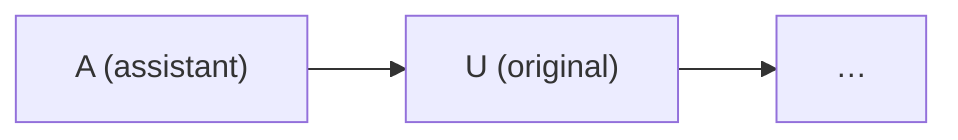

The heuristic is the **shared timestamp**: a real rewind means the user
typed a new message at a different time, so children differ; a replay
re-emits the same turn at the same instant. Validated on real data: fork
points partition cleanly into same-timestamp (compaction) and
different-timestamp (rewind) groups, with no mixed cases observed.

### 7. Real rewind: branch pseudo-sessions

What remains — multiple live, non-structural children at different
timestamps — is a genuine fork: the user went back and re-prompted.

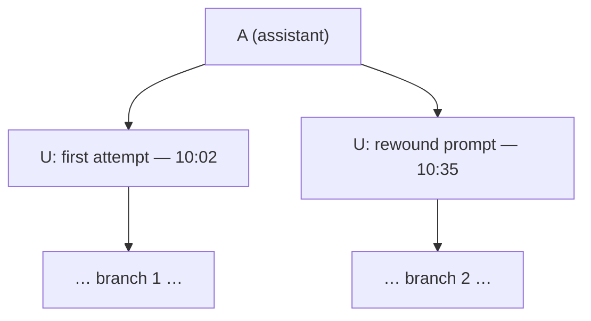

The trunk chain ends at the fork point; **each** child becomes a branch
DAG-line with a synthetic id (`{sessionId}@{uuid12}`), rendered as a
branch pseudo-session with a fork-point navigation box on the parent
message and backlinks on the branch headers:

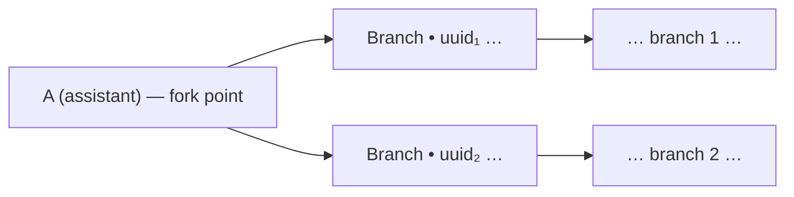

Branch nodes get their `session_id` rewritten to the branch id so the
session tree attaches them at the fork point (`attachment_uuid`).

---

## Compact Boundaries and Multi-Root Sessions

When the user runs `/compact`, Claude Code writes a `system/compact_boundary`
entry with `parentUuid: null`, followed by a user entry carrying the summary
(parsed as `CompactedSummaryMessage`). The pre-compaction context (often
100k+ tokens) is replaced by the summary — a real content discontinuity.

Because the boundary entry has no parent, it becomes a **fresh root within
the same `sessionId`**. A session that was `/compact`ed once has 2 roots;
twice has 3. Early `local_command` entries (e.g. `/memory`) sometimes land
as orphan roots too.

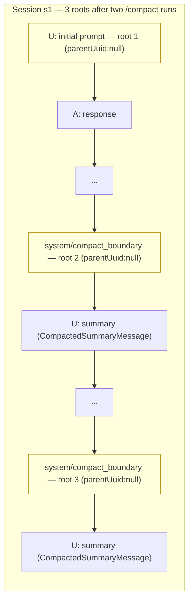

**Multi-root handling in `extract_session_dag_lines`**:

1. Walk every root via `_walk_session_with_forks` (not just the earliest)
   so orphan-promoted subtrees are covered.
2. Merge non-branch DAG-lines from all roots into a single trunk, ordered
   by `first_timestamp`.
3. Classify roots to decide log level (`_classify_unexpected_roots`):
   - `_EXPECTED_ROOT_SYSTEM_SUBTYPES = {"compact_boundary", "local_command"}`
     covers system entries; `_EXPECTED_ROOT_PASSTHROUGH_TYPES = {"progress"}`
     covers passthrough entries. See [Expected Root Types](#expected-root-types)
     below for the full taxonomy.
   - If every non-primary root is one of the expected types → `logger.debug`
   - Otherwise (orphan user/assistant hinting at a missing parent) →
     `logger.warning` with unexpected count

This keeps the signal useful: orphan user/assistant entries still surface
as warnings; routine `/compact` multi-root sessions and async-hook
remnants stay quiet.

### Expected Root Types

Six known shapes legitimately appear as parentless (or orphan-promoted)
roots within a session. Long-running sessions that span multiple
`/compact` runs accumulate roots from several of these categories.

| Shape | parentUuid in JSONL | Why it lands as a root |
|---|---|---|
| **The session's actual first `user` prompt** | `null` | It's the earliest message — no preceding turn exists. |
| `SystemTranscriptEntry` `subtype="compact_boundary"` | `null` | Each `/compact` run writes a fresh boundary entry with no parent. The pre-compaction context is replaced by a summary. |
| `SystemTranscriptEntry` `subtype="local_command"` | sometimes `null` | Early `/memory`, `/config` etc. occasionally land before any user prompt has been recorded. |
| `PassthroughTranscriptEntry` `type="progress"` from a session-start hook (e.g. `SessionStart:clear`) | `null` | Hooks fire **before** the first user turn has a uuid to point at — so the very first entry of a session can be a session-start hook rather than the user prompt. |
| `PassthroughTranscriptEntry` `type="progress"` from an in-flight tool hook (e.g. `PostToolUse:Read`) | promoted from missing parent | A hook still in flight when `/compact` fires loses its spawning `tool_use` to the discarded pre-compaction context. `build_dag` clears the dangling parent and promotes the entry to a root. Always temporally adjacent to a following `compact_boundary`. |
| **Subagent root** (first entry of an agent transcript) | `null` (in the agent file), then back-patched | `_integrate_agent_entries` re-points it at the spawning Task/Agent `tool_result` and assigns a synthetic sessionId `{trunk}#agent-{agentId}`, so by the time `extract_session_dag_lines` runs the subagent has a proper parent and a per-agent root in its own DAG-line — not in the trunk's root list. |

The first five all sit in the trunk's session and feed into the
`extract_session_dag_lines` multi-root warning logic. The subagent shape
is structurally similar but resolved one layer earlier — the trunk
never sees these as orphans because `_integrate_agent_entries` runs
first; see [Agent Transcripts](#agent-transcripts).

### Compaction nav landmarks

(`prepare_session_navigation` in renderer.py): each
`CompactedSummaryMessage` in a session becomes an `is_compaction_point`
nav item (📦 glyph, solid border, depth = parent+1), chronologically
ordered. Clicking jumps to the summary's `#msg-d-X` anchor so the reader
can jump to any compaction point from the session index. Compact points
inside a branch are correctly scoped via `render_session_id`.

**Enriched label** — the landmark label surfaces the pre-compaction
token count and timestamp read from the preceding `system/compact_boundary`
entry's `compactMetadata`:

```
📦 Conversation compacted (115k tokens) • 2026-04-14 09:09:28
```

Plumbing:

- `SystemTranscriptEntry.compactMetadata: Optional[dict]` (models.py)
  carries the raw JSONL field (`preTokens`, `trigger`, `postTokens`,
  `durationMs`).
- `SystemMessage.compact_pre_tokens: Optional[int]` and
  `SystemMessage.compact_trigger: Optional[str]` are populated at
  factory time (`create_system_message`) only for
  `subtype == "compact_boundary"`, with `isinstance()` guards against
  malformed JSONL.
- `_compact_nav_label(comp_msg, uuid_to_msg)` walks from the
  `CompactedSummaryMessage` to its parent via `meta.parent_uuid`, reads
  the token count off the parent's `SystemMessage` when available, and
  formats `preTokens // 1000` as `Nk tokens` (sub-1000 values render
  verbatim).

The label degrades gracefully whenever any step is missing — no
`parent_uuid`, parent filtered out (e.g. at `HIGH` detail level), parent
isn't a `SystemMessage`, or `compact_pre_tokens` is None/zero — by
dropping the `(Nk tokens)` fragment while still appending the summary's
own timestamp. Older transcripts without `compactMetadata` get
`Conversation compacted • <timestamp>`.

`compact_trigger` (`"manual"` / `"auto"`) is plumbed but not rendered.

---

## Assertions / Invariants

These are checked at runtime (log warnings, don't crash):

1. **Session trunk is linear after linearization**: each session's
   non-branch DAG-line is a single chain. Branching within a `sessionId`
   comes from exactly one source that *renders* as branches — explicit
   user rewinds. Every artifact shape (structural side-branches,
   tool-result siblings, live passthrough chains, assistant
   continuations, compaction replays) is linearized by the
   [ladder](#fork-disambiguation-the-linearization-ladder).
2. **Multi-root sessions are tolerated**: `/compact` and `local_command`
   produce multiple roots within one `sessionId`; all are walked and the
   trunks are merged. Other multi-root causes warn (may indicate missing
   parent data).
3. **DAG acyclicity**: `build_dag` walks each node's `parent_uuid`
   chain and nulls the first revisited node's parent if a cycle is
   detected (warns and promotes that node to root). The DAG seen by
   downstream walks is always acyclic; `_walk_session_with_forks`
   adds a `walk_visited` belt for defence-in-depth.
4. **Unique ownership**: after deduplication, each `uuid` belongs to
   exactly one session.
5. **Agent parenting**: every top-level agent transcript has an
   identifiable anchor in the main session.
6. **DAG walk coverage**: `walked ∪ skipped` must equal the session's
   node set; if not, fall back to a timestamp sort for the whole session
   and log a warning.

---

## Related Documentation

- [rendering-architecture.md](rendering-architecture.md) — Rendering pipeline
- [messages.md](messages.md) — Message type reference
- [agents.md](agents.md) — Sync/async/teammate agent integration
