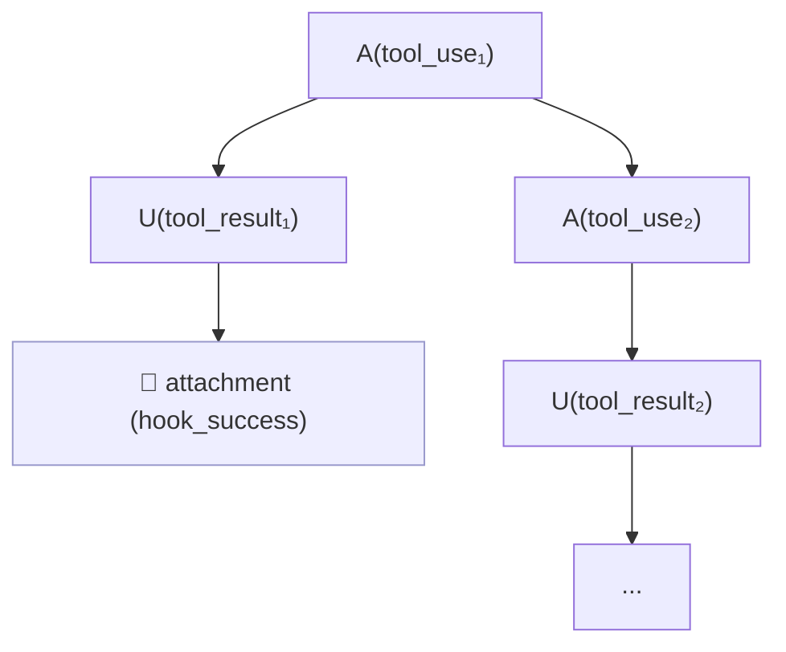
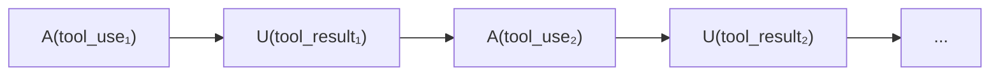
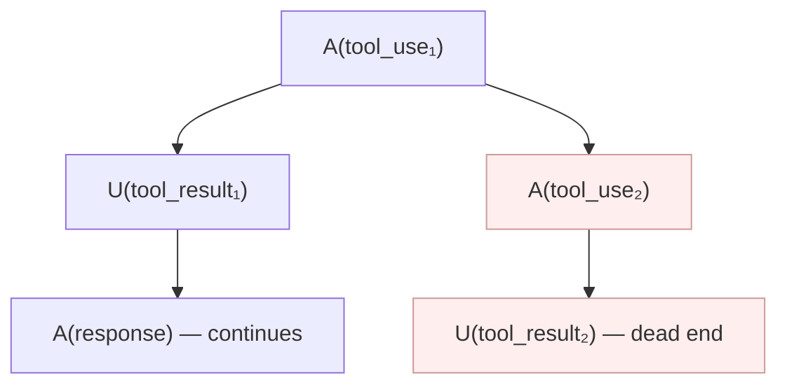
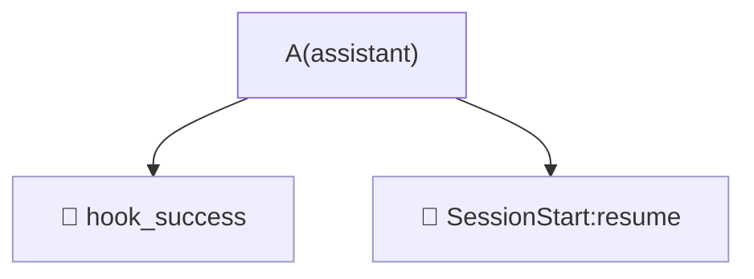
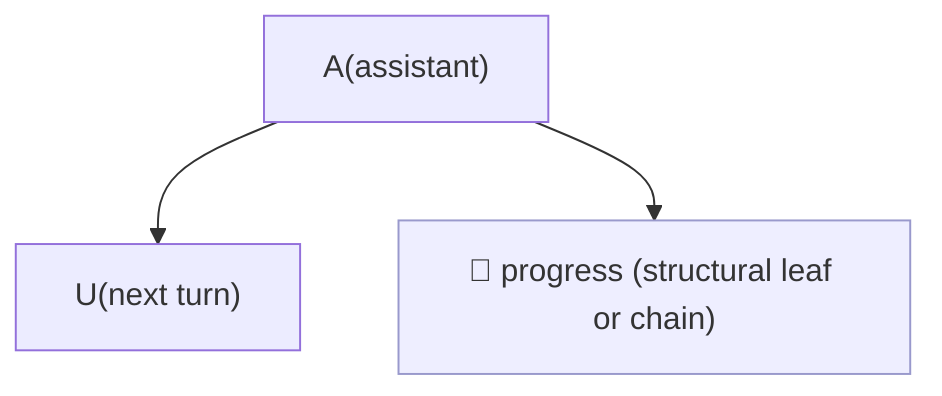
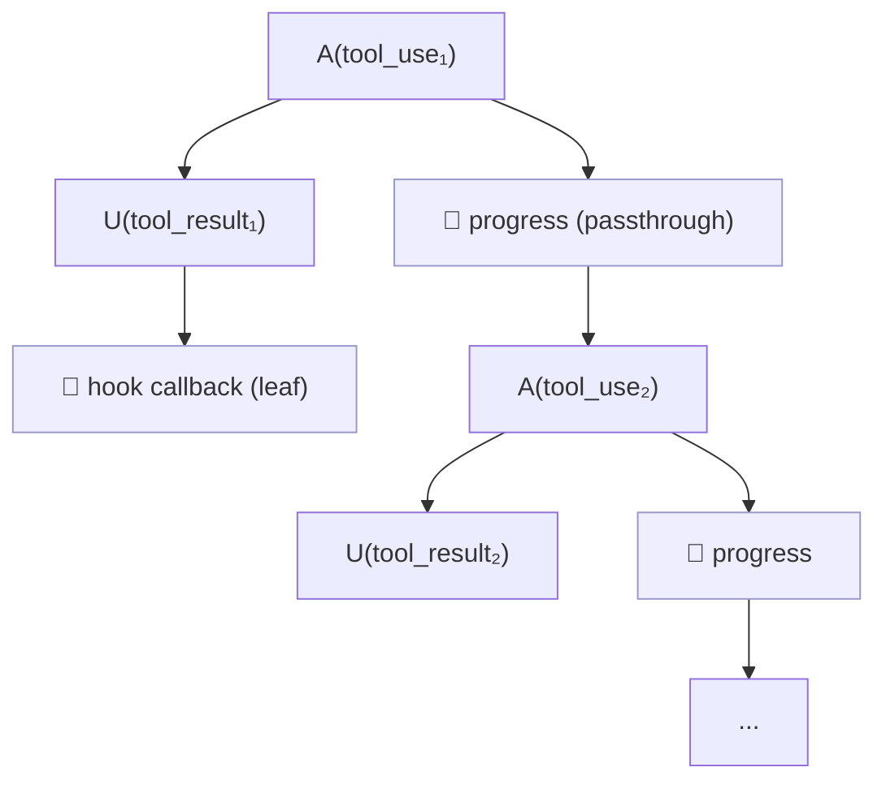
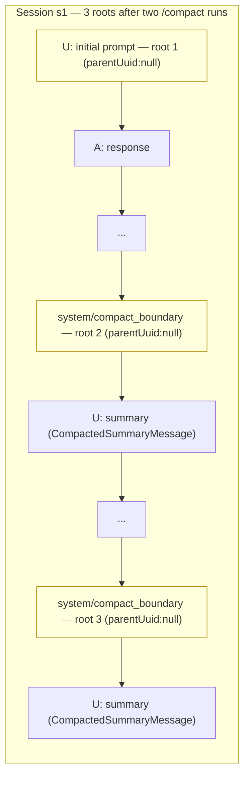

# DAG-Based Message Architecture

> See [application_model.md](application_model.md) for the system overview.

Replaces timestamp-based ordering with `parentUuid` → `uuid` graph traversal.

Reference: [Messages as Commits: Claude Code's Git-Like DAG of Conversations](https://piebald.ai/blog/messages-as-commits-claude-codes-git-like-dag-of-conversations)

Related issues: #79, #85, #90, #91

---

## Motivation

Currently, messages are sorted by timestamp and then patched with post-hoc
fixups (pair reordering, sidechain reordering by `agentId`). This is fragile:

- **Sync agents**: Works "well enough" because timestamps align with causality
- **Async agents** (#90): Agent runs in background; launch and notification
  are temporally distant; agent transcript interleaves arbitrarily
- **Teammates** (#91): Multiple agents send messages concurrently
- **Resume/fork** (#85): Conversation branches share a prefix; timestamp
  ordering can't express the branching structure

The transcript data already contains the structural information we need:
each message's `parentUuid` points to its predecessor, forming a DAG.

---

## Core Concepts

### The DAG

Every message has a `uuid` and a `parentUuid` (null for first messages).
Together they form a directed acyclic graph. The graph is the authoritative
ordering; timestamps are metadata, not structure.

### Sessions and DAG-lines

A **session** is the set of messages sharing a `sessionId`. Each session
forms a single contiguous chain in the DAG — its **DAG-line**. A session's
DAG-line contains only the messages unique to that session (after
deduplication).

**Assertion**: Within a session, the default `parentUuid` chain is linear.
Explicit rewinds create within-session forks that are rendered as branch
pseudo-sessions. Unexpected non-rewind branching logs a warning.

### Junction Points

A **junction point** is a message whose `uuid` is referenced as
`parentUuid` by messages from **different sessions**. This is where
resume/fork happens.

Junction points are **annotations on messages**, not splits of DAG-lines.
A session's DAG-line remains intact; the junction point simply records
"session N forks/continues from here."

### Session Tree

Sessions form a tree:

- **Root sessions**: Their first message has `parentUuid: null` (or points
  to a message not in any loaded session, e.g. after a `/clear`)
- **Child sessions**: Their first unique message's `parentUuid` points into
  a parent session's DAG-line

Children are ordered chronologically (by their first message's timestamp).

Example:

```
Session 1: a → b → c → d → e → f → g
                             ↑           ↑
                             |           |
Session 3: k → l → m        Session 2: h → i → j
(fork from e)                (continues from g)
```

Session tree:
```
- Session 1
  - Session 2 (continues from g)
  - Session 3 (forks from e)
```

Rendered message sequence (depth-first, chronological children):
```
s1, a, b, c, d, e, f, g, s2, h, i, j, s3, k, l, m
```

Where `s1`, `s2`, `s3` are synthesized session header messages.

### Navigation Links

- **Forward links** on junction points: "Session N forks/continues here"
  (shown on message `e` and `g` in the example above)
- **Backlinks** on session headers: "Continues from message X in Session Y"
  (shown on `s2` and `s3`)

> Where branch / session header *titles* (the `Branch • <uuid8> •
> <preview>` text) are assembled is a renderer concern, not a DAG
> concern. See the `SessionHeaderMessage` glossary entry in
> [application_model.md](application_model.md#4-cross-cutting-glossary)
> for the four functions involved (`_branch_label`,
> `_enrich_branch_titles`, `create_session_preview`,
> `simplify_command_tags`).

#### Current: `d-{index}` anchors (combined transcript only)

Backlinks use `#msg-d-{N}` anchors which are sequential indices assigned
during rendering. These are stable within a single render pass (the
combined transcript is always regenerated whole), but shift when any
session grows.

This works for the combined transcript because all links and targets are
on the same page. Individual session pages have independent indices.

#### Future: UUID-based anchors for cross-page linking

Each session's DAG-line can grow independently. If session B grows and
its page is regenerated, `d-{index}` values shift — breaking any link
from session A's (cached) page into B.

When cross-session-page links are needed (e.g. session page A links to
a junction point in session page B), add stable UUID-based anchors:

```html
<div id="msg-{uuid}" ...>  <!-- stable, never shifts -->
```

Use `msg-{uuid}` on junction points and attachment messages. Keep
`msg-d-{N}` for everything else (session nav, timeline, etc.).

### Deduplication

When session 2 resumes session 1, Claude Code may replay prefix messages
(d', e', f', g') into session 2's file. These duplicates share the same
`uuid` but have a different `sessionId`.

Resolution: deduplicate by `uuid`, keeping the instance from the
**earliest session** (by first message timestamp). The "new" messages in
session 2 (those with previously-unseen `uuid`) form its DAG-line.

### Agent Transcripts

Agent transcripts also form DAG-lines. They come in two flavors:

1. **Continuing agents**: Their `parentUuid` chains into a previous agent's
   DAG-line (same session, different `agentId`). These naturally fit the
   DAG.

2. **Top-level agents**: `parentUuid` is null. These need explicit
   **parenting** — splicing them into the main session's DAG-line at the
   appropriate point.

   For `x → y → z` where `y` is a Task, and agent transcript `u → v` needs
   to be rooted at `y`, the result is: `x → y → u → v → z`.

**Parenting strategies** (by agent type):

| Agent type | Link mechanism | Parent at |
|------------|---------------|-----------|
| Sync Task | `agentId` on tool_result | Task tool_result message |
| Async Task (#90) | `agentId` on launch tool_result, `task-id` in `<task-notification>` | Launch tool_result |
| Teammate (#91) | `team_name` + agent name | TBD — likely TeamCreate or Task-with-team |

---

## Algorithm

### Phase 1: Load All Sessions

Load **all** `.jsonl` files for a project directory. Build a unified message
index:

```python
messages_by_uuid: dict[str, TranscriptEntry]   # uuid → entry (oldest wins)
children_by_uuid: dict[str, list[str]]          # parentUuid → [child uuids]
sessions: dict[str, list[str]]                  # sessionId → [uuids in chain order]
```

When targeting a single session, still load all files but only render
that session's subtree. Optionally warn that context from other sessions
is available.

### Phase 2: Build DAG and Deduplicate

1. Parse all entries, index by `uuid`
2. For duplicate `uuid`s, keep the one from the earliest `sessionId`
3. Group messages by `sessionId`
4. `build_dag(nodes, sidechain_uuids)` populates `children_uuids` —
   in three steps that **must run in this order** (PR #135):

   ```mermaid
   flowchart TB
       A["entries indexed by uuid<br/>(parent_uuid pointers may<br/>dangle or cycle)"] --> S1
       S1["Step 1 — orphan promotion<br/>parent_uuid not in nodes →<br/>null it; warn unless the<br/>parent is a known sidechain<br/>uuid (silently promote)"] --> S2
       S2["Step 2 — cycle break<br/>walk parent_uuid from each<br/>node; revisit ⇒ null the<br/>revisited node's parent;<br/>warn"] --> S3
       S3["Step 3 — children build<br/>for each node with non-null<br/>parent_uuid, append to<br/>parent.children_uuids;<br/>skip self-loops, dedup"] --> O["acyclic parent→children DAG<br/>safe to walk"]
       classDef step fill:#eef,stroke:#99c
       class S1,S2,S3 step
   ```

   Steps 1 and 2 mutate `parent_uuid` on the input nodes (they're
   one-way: a promoted-to-root node can't recover its dangling
   parent later). Step 3 is the only step that builds the
   `children_uuids` lists. Doing children first would propagate
   any cyclic edge into the children graph, and downstream walks
   via `children_uuids` would loop forever — so cycles must be
   broken at the parent-pointer layer before children are
   materialised.

### Phase 3: Extract Session DAG-lines

For each session (`extract_session_dag_lines` in `dag.py`):
1. Identify the session's unique messages (those whose authoritative
   `sessionId` matches)
2. Find roots (nodes whose `parent_uuid` is null or points outside the
   session). A session may have **multiple roots** — see
   [Compact Boundaries and Multi-Root Sessions](#compact-boundaries-and-multi-root-sessions).
3. Walk each root via `_walk_session_with_forks`, following same-session
   children. Single-child → chain continues. Multiple same-session
   children → distinguish real forks from artifacts using the heuristics
   below.
4. Merge trunk DAG-lines from multiple roots into a single chain
   (ordered by `first_timestamp`); branch DAG-lines stay separate.
5. If DAG walk coverage is incomplete, fall back to a timestamp sort for
   the whole session.

**Defence-in-depth in the walker** (PR #135): even though `build_dag`
breaks parent-pointer cycles before populating `children_uuids`, a
future bug or hand-edited fixture could reintroduce a cyclic edge
*after* DAG construction. `_walk_session_with_forks` keeps a
`walk_visited: set[str]` across the whole queue-driven walk; if a
uuid is visited twice, the chain is truncated at that point and a
warning is logged. The build-time cycle break and this walk-time
guard together rule out the unbounded-loop class of hangs that
motivated the PR.

### Phase 4: Build Session Tree

1. For each session, find where its DAG-line attaches to the DAG:
   - Walk back from the session's first unique message via `parentUuid`
   - The first message belonging to a **different** session is the
     attachment point
2. The session whose message is the attachment point is the parent session
3. Root sessions have no attachment point (first message is `parentUuid: null`
   or points outside loaded data)
4. Order children chronologically

### Phase 5: Identify Junction Points

A message is a junction point if `children_by_uuid[msg.uuid]` contains
messages from multiple sessions, or from a session different than the
message's own.

Annotate junction points with their target sessions for forward-link
rendering.

### Phase 6: Splice Agent Transcripts

For each agent transcript (identified by `agentId`):
1. Determine parenting strategy (see table above)
2. Find the anchor message in the main session's DAG-line
3. Splice the agent's DAG-line after the anchor

This replaces the current `_reorder_sidechain_template_messages` approach
with a principled graph operation.

### Phase 7: Process and Render

Within each DAG-line, apply existing processing:
- Pairing (tool_use+tool_result, thinking+assistant, etc.)
- Hierarchy building
- Tree construction

Pairing should be **scoped to DAG-lines** — no pairing across session
boundaries. This is both correct and faster.

---

## Caveats

### Context Compaction Replays

When Claude Code compacts context (inserting a `SummaryTranscriptEntry`), it
**replays** the conversation from a certain point with **new UUIDs** but the
**same `parentUuid` and timestamp** as the original entries. This creates
multiple same-session children from a single parent — structurally identical
to a user rewind (fork), but semantically a replay.

**Distinguishing heuristic**: timestamps.

- **Real fork (rewind)**: the user goes back and types a new message at a
  different time → children have **different** timestamps.
- **Compaction replay**: the system re-emits the same turn → children share
  the **same** timestamp as the original.

When `_walk_session_with_forks()` encounters a node with multiple same-session
children that all share the same timestamp, it follows only the **first**
child (the original chain) and ignores the later replay chains. This avoids
creating hundreds of false branch pseudo-sessions in long-running sessions
with frequent compaction.

The heuristic is validated on real data: across all fork points, forks
partition cleanly into same-timestamp (compaction) vs different-timestamp
(rewind) groups, with no mixed cases observed.

### Tool-Result Side-Branches

When the assistant makes **multiple tool calls** in one turn, the JSONL
records both the next `tool_use` and the previous `tool_result` as children
of the same parent entry. Without intervention this creates a fake fork at
every parallel-tool_use turn. `_stitch_tool_results()` and the all-passthrough
clause in `_walk_session_with_forks()` detect three patterns and splice the
side-branch back into the main chain.

#### Variant 1 — User child's subtree is purely structural

The `tool_result` for the first parallel call is recorded as a sibling of
the `tool_use` for the second call. The `tool_result` itself is conversation
content, but its subtree carries only a `hook_success` attachment leaf and
no further user/assistant descendants.

Pre-fix DAG (looks like a fork):



Post-fix — `_is_structural_subtree(U₁)` returns true (no user/assistant
descendants), so `U₁` is stitched into the chain ahead of the continuation
`A₂`, and the attachment is collapsed in as a non-rendered side entry:



The earlier "no immediate same-session child" check missed Variant 1 when
a `hook_success` attachment sat under the `tool_result`. That's the shape
of all 22 fake forks observed in the BCT Teamcenter 1594-entry test file.

#### Variant 2 — Assistant subtree dead-ends

Claude Code sometimes emits a second `tool_use` that terminates without
producing a continuation — a progress artifact. The `tool_result` for the
first call **does** continue the main conversation, so the fix stitches the
dead `tool_use` subtree into the chain before the continuing `tool_result`.



Detected by `_is_subtree_dead_end()`: exactly one user child has a live
continuation; every assistant child's subtree dead-ends within the session.

#### Structural-side-branch collapse — at most one non-structural sibling

A `PassthroughTranscriptEntry` (attachment, `hook_success`,
`SessionStart:resume`, `progress`) alongside a regular sibling is an
artifact, not a fork. The DAG walker partitions children into
`structural_kids` (passthrough roots with a structural subtree per
`_is_structural_subtree`) and `non_structural`, then collapses when
`structural_kids and len(non_structural) <= 1`. The chain continues
through the single non-structural child, or terminates if there isn't
one.

This catches two real-world shapes with the same rule:

**Shape A — all-passthrough:** two attachments on the same parent, often
at far-apart timestamps so the compaction-replay heuristic doesn't apply.



Collapsed: both passthroughs appended to the chain (chronological), chain
terminates (`current = None`).

**Shape B — mixed user + progress sibling:** a conversational child
alongside a bare `<progress>` leaf or chain. Previously fell through to
the different-timestamps fork path and produced a spurious
`Fork point (1 branches)` entry after `alice-fix-nav-anchors` pruned the
dead-link side.



Collapsed: `P` stitched chronologically into the chain, `current = U`
continues the conversation.

The partition is strict about what counts as structural: only
`PassthroughTranscriptEntry` roots with a purely structural subtree
qualify. A `UserTranscriptEntry` with a passthrough-only subtree (the
Variant 1 shape in the next subsection) falls into `non_structural` and
is handled by `_stitch_tool_results` instead — Variant 1 and the
structural-collapse paths don't overlap.

**Defense-in-depth** — the `_is_structural_subtree(c)` check is applied
in addition to the `isinstance(c, PassthroughTranscriptEntry)` test.
Today passthrough entries are always leaves, but if a future passthrough
type ever carries conversational descendants, it will correctly fall
through to the normal fork logic instead of masking the content.

#### Variant 3 — Parallel-tool_use chain via passthrough

Real Claude Code teammate transcripts (CC 2.1.32+) thread parallel
tool_uses through `progress` passthroughs rather than as direct
`tool_use` siblings. Each parallel turn produces a 2-child fork at the
spawning assistant: the user(tool_result) for the first parallel call
sits beside a passthrough that chains into the next assistant tool_use.
The passthrough subtree carries the live continuation; the
user(tool_result) carries only structural callbacks (a hook
acknowledgement leaf), so it dead-ends.



Detection in `_walk_session_with_forks`: exactly one passthrough child
has a non-structural subtree (live continuation), and every other
sibling has a structural subtree (no user/assistant descendants). The
passthrough sibling becomes the chain continuation; the dead-end
user/assistant siblings are appended to the chain inline and their
descendants are collected into `skipped`.

Variants 1 and 2 in `_stitch_tool_results` share the same
"user-tool_result vs assistant-tool_use" framing and don't fire when
the live continuation is a passthrough; the earlier
structural-side-branch collapse (which only treats *passthrough* kids
as structural) doesn't fire when the structural sibling is a
user(tool_result). Variant 3 fills that gap. Distinct from real user
rewinds, which never include passthrough children.

The fix also relies on `_is_structural_subtree` being unbounded over
the subtree (no depth cap): real `progress` chains under a
parallel-tool_use anchor regularly run >20 entries deep.

#### Summary of detection criteria

| Pattern | Detection | Action |
|---------|-----------|--------|
| Variant 1 | `_is_structural_subtree(U)` true for every user child; exactly one assistant continuation | Splice user children ahead of assistant continuation |
| Variant 2 | `_is_subtree_dead_end(A)` true for every assistant child; exactly one user continuation | Splice assistant children ahead of user continuation |
| Variant 3 | Exactly one passthrough child with non-structural subtree; every other child has a structural subtree | Append dead-end siblings to chain; continue through the live passthrough |
| Structural side-branch collapse | At least one structural passthrough child; ≤1 non-structural child | Collapse structural children into chain; continue via the single non-structural (or terminate) |
| Real rewind | Multiple non-structural children at different timestamps | Real within-session fork → branch pseudo-sessions |
| Compaction replay | Multiple children sharing the same timestamp | Follow first, skip rest (see next section) |

Subtree descendants of stitched/collapsed side-branch nodes are added to
the `skipped` set for coverage accounting, so the "DAG walk coverage
incomplete" fallback doesn't fire.

### Compact Boundaries and Multi-Root Sessions

When the user runs `/compact`, Claude Code writes a `system/compact_boundary`
entry with `parentUuid: null`, followed by a user entry carrying the summary
(parsed as `CompactedSummaryMessage`). The pre-compaction context (often
100k+ tokens) is replaced by the summary — a real content discontinuity.

Because the boundary entry has no parent, it becomes a **fresh root within
the same `sessionId`**. A session that was `/compact`ed once has 2 roots;
twice has 3. Early `local_command` entries (e.g. `/memory`) sometimes land
as orphan roots too.



**Multi-root handling in `extract_session_dag_lines`** (dag.py):

1. Walk every root via `_walk_session_with_forks` (not just the earliest)
   so orphan-promoted subtrees are covered.
2. Merge non-branch DAG-lines from all roots into a single trunk, ordered
   by `first_timestamp`.
3. Classify roots to decide log level:
   - `_EXPECTED_ROOT_SYSTEM_SUBTYPES = {"compact_boundary", "local_command"}`
     covers system entries; `_EXPECTED_ROOT_PASSTHROUGH_TYPES = {"progress"}`
     covers passthrough entries. See [Expected Root Types](#expected-root-types)
     below for the full taxonomy.
   - If every non-primary root is one of the expected types → `logger.debug`
   - Otherwise (orphan user/assistant hinting at a missing parent) →
     `logger.warning` with unexpected count

This keeps the signal useful: orphan user/assistant entries still surface
as warnings; routine `/compact` multi-root sessions and async-hook
remnants stay quiet.

#### Expected Root Types

Six known shapes legitimately appear as parentless (or orphan-promoted)
roots within a session. Long-running sessions that span multiple
`/compact` runs accumulate roots from several of these categories.

| Shape | parentUuid in JSONL | Why it lands as a root |
|---|---|---|
| **The session's actual first `user` prompt** | `null` | It's the earliest message — no preceding turn exists. |
| `SystemTranscriptEntry` `subtype="compact_boundary"` | `null` | Each `/compact` run writes a fresh boundary entry with no parent. The pre-compaction context is replaced by a summary. |
| `SystemTranscriptEntry` `subtype="local_command"` | sometimes `null` | Early `/memory`, `/config` etc. occasionally land before any user prompt has been recorded. |
| `PassthroughTranscriptEntry` `type="progress"` from a session-start hook (e.g. `SessionStart:clear`) | `null` | Hooks fire **before** the first user turn has a uuid to point at — so the very first entry of a session can be a session-start hook rather than the user prompt. |
| `PassthroughTranscriptEntry` `type="progress"` from an in-flight tool hook (e.g. `PostToolUse:Read`) | promoted from missing parent | A hook still in flight when `/compact` fires loses its spawning `tool_use` to the discarded pre-compaction context. `build_dag` clears the dangling parent and promotes the entry to a root. Always temporally adjacent to a following `compact_boundary`. |
| **Subagent root** (first entry of an agent transcript) | `null` (in the agent file), then back-patched | Subagent transcripts live in `<session>/subagents/agent-*.jsonl` with `parentUuid: null` on entry zero. `_integrate_agent_entries` re-points it at the spawning Task/Agent `tool_result` and assigns a synthetic sessionId `{trunk}#agent-{agentId}`, so by the time `extract_session_dag_lines` runs the subagent has a proper parent and a per-agent root in its own DAG-line — not in the trunk's root list. |

The first five all sit in the trunk's session and feed into the
`extract_session_dag_lines` multi-root warning logic. The subagent shape
is structurally similar but resolved one layer earlier — the trunk
never sees these as orphans because `_integrate_agent_entries` runs
first; see [Agent Transcripts](#agent-transcripts).

**Nav landmarks** (`prepare_session_navigation` in renderer.py): each
`CompactedSummaryMessage` in a session becomes an `is_compaction_point`
nav item (📦 glyph, solid border, depth = parent+1), chronologically
ordered. Clicking jumps to the summary's `#msg-d-X` anchor so the reader
can jump to any compaction point from the session index. Compact points
inside a branch are correctly scoped via `render_session_id`.

**Enriched label** — the landmark label surfaces the pre-compaction
token count and timestamp read from the preceding `system/compact_boundary`
entry's `compactMetadata`:

```
📦 Conversation compacted (115k tokens) • 2026-04-14 09:09:28
```

Plumbing:

- `SystemTranscriptEntry.compactMetadata: Optional[dict]` (models.py)
  carries the raw JSONL field (`preTokens`, `trigger`, `postTokens`,
  `durationMs`).
- `SystemMessage.compact_pre_tokens: Optional[int]` and
  `SystemMessage.compact_trigger: Optional[str]` are populated at
  factory time (`create_system_message`) only for
  `subtype == "compact_boundary"`, with `isinstance()` guards against
  malformed JSONL.
- `_compact_nav_label(comp_msg, uuid_to_msg)` walks from the
  `CompactedSummaryMessage` to its parent via `meta.parent_uuid`, reads
  the token count off the parent's `SystemMessage` when available, and
  formats `preTokens // 1000` as `Nk tokens` (sub-1000 values render
  verbatim).

The label degrades gracefully whenever any step is missing — no
`parent_uuid`, parent filtered out (e.g. at `HIGH` detail level), parent
isn't a `SystemMessage`, or `compact_pre_tokens` is None/zero — by
dropping the `(Nk tokens)` fragment while still appending the summary's
own timestamp. Older transcripts without `compactMetadata` get
`Conversation compacted • <timestamp>`.

`compact_trigger` (`"manual"` / `"auto"`) is plumbed but not yet
rendered; visualization is deferred pending a decision on whether to
distinguish the two in the label glyph or suffix.

---

## Assertions / Invariants

These should be checked at runtime (log warnings, don't crash):

1. **Session trunk is linear after stitching**: each session's non-branch
   DAG-line is a single chain. Branching within a `sessionId` comes from
   exactly three sources:
   - **Explicit user rewinds** → rendered as branch pseudo-sessions
   - **Parallel tool_use / dead-end tool_use / all-passthrough
     children** → stitched or collapsed (not rendered as branches); see
     [Tool-Result Side-Branches](#tool-result-side-branches)
   - **Compaction replays** (same-timestamp children) → first child only
2. **Multi-root sessions are tolerated**: `/compact` and `local_command`
   produce multiple roots within one `sessionId`; all are walked and the
   trunks are merged. Other multi-root causes warn (may indicate missing
   parent data).
3. **DAG acyclicity**: `build_dag` walks each node's `parent_uuid`
   chain and nulls the first revisited node's parent if a cycle is
   detected (warns and promotes that node to root). The DAG seen by
   downstream walks is always acyclic; `_walk_session_with_forks`
   adds a `walk_visited` belt for defence-in-depth.
4. **Unique ownership**: After deduplication, each `uuid` belongs to
   exactly one session
5. **Agent parenting**: Every top-level agent transcript has an identifiable
   anchor in the main session
6. **DAG walk coverage**: `walked | skipped` must equal the session's
   node set; if not, fall back to a timestamp sort for the whole session
   and log a warning

---

## Impact on Existing Code

### What changes

| Component | Current | After |
|-----------|---------|-------|
| `converter.py` | Load single file + agent files; timestamp sort | Load all project files; build DAG |
| `renderer.py` message ordering | Timestamp sort + pair reorder + sidechain reorder | DAG-line traversal; pairing within DAG-lines |
| Session index | Flat list sorted by timestamp | Session tree with parent/child relationships |
| Agent handling | `agentId`-based insertion after timestamp sort | Agent DAG-line splicing at anchor points |

### What stays

- Factory layer (transcript entry → MessageContent)
- TemplateMessage wrapper and RenderingContext
- Hierarchy building within sessions (user → assistant → tools)
- Renderer dispatch and format_* methods
- HTML templates and JavaScript (fold, timeline, filters)
- Deduplication heuristics (sidechain cleanup, etc.) — may simplify over time

---

## Implementation Plan

### Phase A: DAG Infrastructure (new module: `dag.py`)

1. **Message indexing**: Load all session files, build `uuid` index,
   deduplicate
2. **DAG construction**: Build parent→children graph
3. **Session extraction**: Group by `sessionId`, extract DAG-lines,
   verify linearity
4. **Session tree**: Build parent/child session relationships, identify
   junction points

This phase is purely additive — new code alongside existing. Tests can
validate DAG construction against known transcripts.

### Phase B: Integration with Rendering Pipeline

1. Replace `load_transcript` / `load_directory_transcripts` with
   DAG-based loading in `converter.py`
2. Pass DAG-lines (per session) into `generate_template_messages`
3. Scope pairing to DAG-lines
4. Generate session headers with navigation links (forward/back)
5. Update session index from flat to hierarchical

### Phase C: Agent Transcript Rework (Steps 1-2 done)

1. ~~Implement parenting strategies for each agent type~~ — Done:
   `_integrate_agent_entries()` parents agent roots to anchors and assigns
   synthetic session IDs (`{sessionId}#agent-{agentId}`)
2. ~~Replace `_reorder_sidechain_template_messages` with DAG-line splicing~~
   — Done: agents are now DAG-ordered; the old function is kept as fallback
3. Simplify or remove `_cleanup_sidechain_duplicates` (dedup now
   happens at DAG level) — TODO
4. Agent tool renderer (separate PR, `dev/user-sidechain` branch) — TODO

### Phase D: Async Agent and Teammate Support

1. Parse `<task-notification>` to extract `task-id` for async agent linking
2. Implement teammate parenting strategy (#91)
3. This is where #90 and #91 get properly resolved

---

## Related Documentation

- [rendering-architecture.md](rendering-architecture.md) — Current pipeline
- [messages.md](messages.md) — Message type reference
- [../work/rendering-next.md](../work/rendering-next.md) — Future rendering improvements
