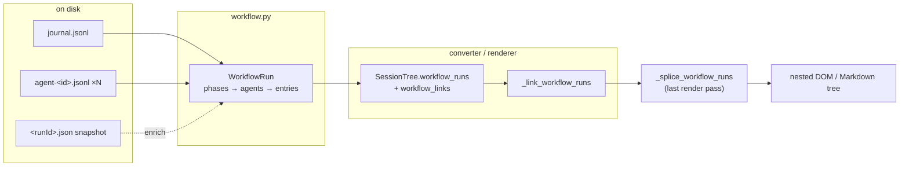
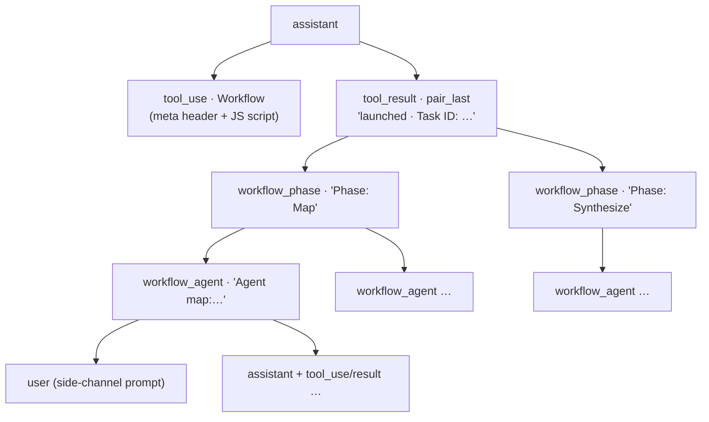

# Dynamic Workflows

> See [application_model.md](application_model.md) for the system overview.
> Issue [#174](https://github.com/daaain/claude-code-log/issues/174); landed
> as PR #191 (nested DOM), #203 (parsing), #205 (tool-input rendering),
> #210 (tree rendering) plus visual-polish follow-ups.

A **dynamic workflow** is Claude Code's `Workflow` tool: the assistant
submits a JavaScript orchestrator script that fans out into many
side-channel sub-agents, grouped into phases. `claude-code-log` renders
the whole run — orchestrator script, phases, per-agent cards, and each
agent's full side-channel transcript — as a nested sub-tree at the
`Workflow` tool_use site.



## 1. On-disk layout

A run under a trunk session `<sid>.jsonl` leaves:

```
<sid>/subagents/workflows/<runId>/
    journal.jsonl                 live spine: started/result events, keyed by agentId
    agent-<agentId>.jsonl         per-agent side-channel transcript
    agent-<agentId>.meta.json     {"agentType": "workflow-subagent"}
<sid>/workflows/<runId>.json      terminal snapshot: phases + per-agent metadata
<sid>/workflows/scripts/<name>-<runId>.js   the JS orchestrator source
```

`journal.jsonl` exists from the start of the run and carries the full
per-agent results; `<runId>.json` appears only on completion. A running
workflow therefore parses with agents in journal order and **no phase
grouping** (`has_snapshot=False`).

## 2. Parse model ([`workflow.py`](../claude_code_log/workflow.py))

`parse_workflow_run` is **journal-led, snapshot-enriched**:

- `WorkflowRun` — `run_id`, `task_id`, `workflow_name`, `status`,
  `phases`, flat `agents` (journal launch order), run `result`, token
  totals, `has_snapshot`.
- `WorkflowPhase` — `index`, `title`, `detail`, member `agents` (the
  same `WorkflowAgent` objects as the flat list).
- `WorkflowAgent` — `agent_id`, `label`, phase membership, `model`,
  `state`, `tokens`, `tool_calls`, `result` (a dict for
  `StructuredOutput` agents, a string for plain-text agents, `None`
  while in flight), and `entries`: the agent's side-channel transcript
  loaded via `load_transcript`.

Two real-data quirks the parser absorbs:

- **Phase-index base mismatch**: the snapshot's `phases[]` array is
  0-based but each agent's `phaseIndex` (and `workflow_phase` progress
  nodes) is 1-based. `_group_into_phases` therefore assigns agents to
  phases **by `phaseTitle`** (authoritative), falling back to the index
  only when the title is missing/unmatched.
- **`agentCount` undercounts**: the snapshot counts only agents that
  produced a result; the journal lists every launched agent
  (retries/abandoned included), so `len(run.agents)` can exceed
  `run.agent_count`.

`load_workflow_runs(directory)` walks every session dir under a project;
`load_session_workflow_runs(<sid>.jsonl)` derives the sibling
`<sid>/subagents/workflows/` for a single-file render. Both share
`_runs_in_session_dir`.

## 3. Linking a run to its tool_use

The `runId` is **not** recoverable from the rendered tool_result — it
lives only in the structured `toolUseResult` that the factory layer
drops. The durable join key is the **taskId**: the Workflow tool_result
content carries `Task ID: <taskId>`, which equals the snapshot's
`taskId` (`WorkflowRun.task_id`).

Linking is resolved at **full-session scope, before pagination**:
`map_workflow_runs_by_tool_use` scans the raw entries for `Workflow`
tool_uses and their paired tool_results, producing a
`{tool_use_id: WorkflowRun}` map stored on
`SessionTree.workflow_links` (next to `workflow_runs`, keyed by runId).
`_link_workflow_runs` (renderer link pass) prefers that map — which is
what keeps the linkage working when pagination puts the tool_use and its
tool_result on **different pages** — and falls back to scanning the
current render's tool_results for `Task ID:` when no map is supplied
(e.g. a direct `generate_template_messages` call). Either way the run
lands on `WorkflowToolInput.workflow_run`.

`load_directory_transcripts` populates both `SessionTree` fields;
`convert_jsonl_to`'s single-file branch builds a `SessionTree` carrying
them **only when runs exist**, so a no-workflow single-file render keeps
`session_tree=None` and is byte-identical to before.

## 4. The Workflow tool_use header (snapshot-first)

`format_workflow_input` renders a meta header (name, description, phase
pills) above the syntax-highlighted JS orchestrator.
`resolve_workflow_header` sources it **snapshot-first**: when the linked
run has a snapshot, `workflowName` and the snapshot phase titles win
over the best-effort `export const meta = {...}` regex
(`parse_workflow_meta`), which remains the fallback for a running
workflow. The description always comes from the JS meta (the snapshot
has no description field). When the snapshot has a name/phases but the
JS parse missed them, a warning flags probable script-format drift.

Each phase pill is an **anchor link** to its spliced phase card: the
splice records the phase cards' `message_index` values on
`WorkflowToolInput.phase_anchor_indices` (snapshot-phase order, parallel
to the pill list), and the `hashchange` handler in `transcript.html`
unfolds the folded target on click.

## 5. The splice (`_splice_workflow_runs`)

The run tree is built as a **self-contained sub-tree after
`_build_message_tree`** and attached via `.children` — it never touches
`_build_message_hierarchy` / `_relocate_subagent_blocks` (the 0–5
level-stack cannot express phase→agent→sidechain, and the blast radius
on non-workflow rendering would be high). Key mechanics:

- **Runs LAST** in `generate_template_messages` (after
  `_link_task_id_consumers`): it appends nodes through `ctx.register`,
  so it must follow every pass that iterates `ctx.messages`.
- **Index allocation** is `ctx.register` itself
  (`message_index = len(ctx.messages)`, append) — an inherently
  session-wide monotonic allocator, collision-free across several (even
  concurrent) workflows in one session. `message_id` (`d-{N}`) is a
  property of `message_index`, so anchors come for free.
- **Attaches to the paired tool_result** (falling back to the tool_use
  for a running workflow with no result yet): the tool_use/tool_result
  pair renders as one visually joined unit (`pair_first` flat bottom +
  `pair_last` flat top), so hanging the tree off the tool_use would
  wedge it between the two cards. Off the result, the pair stays
  adjacent and the tree reads as the run's outcome below it.
- **Side-channel grafting** (`_graft_agent_sidechannel`): each agent's
  `entries` are re-rendered through a nested
  `generate_template_messages` call, then every produced node is
  re-registered into the main ctx (fresh monotonic indices) and its
  pairing references (`pair_first`/`pair_middle`/`pair_last`) remapped
  into the new index space. The side-channel renders at FULL detail
  regardless of the main render's level (see § 7).
- **Counts**: `has_children`/`is_paired` are derived properties, and
  the stock `_mark_messages_with_children` ran pre-splice, so a
  bottom-up helper (`_recount_spliced_children`) computes the synthetic
  nodes' descendant counts and *increments* the attach node's and its
  ancestors' totals (correct even when the host already had children).



## 6. Rendering the synthetic nodes

Two `MessageContent` subclasses in [`models.py`](../claude_code_log/models.py):

| Node | `message_type` | Title | Body |
|---|---|---|---|
| `WorkflowPhaseMessage` | `workflow_phase` | `Phase: <title>` (🧩) | phase `detail` + agent count |
| `WorkflowAgentMessage` | `workflow_agent` | `Agent <label>` (🤖) | meta line (model/state/tokens/tool calls) + result |

- Titles live on the **shared base `Renderer`** (format-neutral, like
  `title_ThinkingMessage`); `format_*` methods exist on both
  `HtmlRenderer` and `MarkdownRenderer`.
- **Agent results**: a dict renders through the generic
  `render_params_table` key/value table (so generic-tool renderer
  upgrades apply automatically); a list keeps the pretty-printed,
  Pygments-highlighted JSON view (the `render_async_result_body`
  `{"`-heuristic would mis-route `[...]`); a string renders as
  collapsible Markdown. Markdown output fences dict/list as ```json.
- **CSS**: both types register as `["tool_use", "workflow_phase"]` /
  `["tool_use", "workflow_agent"]` in `CSS_CLASS_REGISTRY` — the
  `tool_use` class keeps them governed by the runtime "Tool Use" filter
  toggle; the modifier drives styling and the timeline.
- **Indentation is depth-driven with aligned group borders**
  (`message_styles.css`): each workflow node's `.children` container
  carries the same `margin-left` as the cards (2em, mirrored as `2%`
  inside the ≤1280px responsive block), so the container's border-left
  lands at the exact x of its parent card's border — the group border
  reads as the card's border continuing down its subtree. Colors pair
  per level: a phase card + its agents group are dark green
  (`--workflow-phase-color`), an agent card + its side-channel group
  are grey (`--workflow-agent-color`). The Workflow-level phases group
  keeps its indent but draws no line (suppressed at 0px — two levels of
  lines already distinguish a workflow from a standard sub-agent's
  single grey sidechain line, which uses the same grey). Depth
  accumulates through DOM nesting, so arbitrarily deep future nests (a
  sub-agent spawning its own sub-agents) indent with no new rules.
- **Timeline** (`components/timeline.html`): dedicated
  `workflow_phase` / `workflow_agent` lanes, with detection branches
  placed *before* the generic `tool_use` match (same pattern as
  `teammate` / `task-notification`). Like the other tool lanes they
  have no filter toggle, so they're always visible in the timeline.
- **Fold labels**: `_format_type_counts` maps the types to
  "phase(s)" / "agent(s)" so fold bars read "2 phases", "3 agents".

## 7. Detail levels

The splice only materialises at `full` / `high`: the Workflow tool_use
is dropped at `low` (it's not in `_LOW_KEEP_TOOLS`) and below, taking
the attach point with it. Within a spliced tree, the agents'
side-channel transcripts are rendered by a nested
`generate_template_messages(entries)` call at **default FULL detail**
regardless of the main render's level — at `--detail high` an agent's
side-channel may therefore still show FULL-only content (system/hook
entries). Accepted behaviour: the side-channel is an opt-in deep-dive
under a fold.

## 8. Known limitations

- **Side-channel backlinks**: jump-to-call backlinks computed inside an
  agent's sub-render (e.g. cron/task-id cross-links) are *not* remapped
  into the main index space — only pairing references are. Agent
  transcripts are typically simple read-heavy chains; revisit if that
  changes.
- **Fold-label counts**: `_recount_spliced_children` counts a
  tool_use+tool_result pair as 2 (the stock counter's pairing-skip
  convention is deliberately dropped inside the run tree), so "N
  descendants" labels can read slightly high on tool-heavy
  side-channels.

## 9. Key files & tests

- [`workflow.py`](../claude_code_log/workflow.py) — parse + discovery +
  header resolution + full-scope linkage map.
- [`converter.py`](../claude_code_log/converter.py) — populates
  `SessionTree.workflow_runs` / `workflow_links` (directory and
  single-file paths).
- [`dag.py`](../claude_code_log/dag.py) — the two `SessionTree` fields.
- [`renderer.py`](../claude_code_log/renderer.py) —
  `_link_workflow_runs`, `_splice_workflow_runs`,
  `_graft_agent_sidechannel`, `_recount_spliced_children`, titles.
- [`models.py`](../claude_code_log/models.py) — `WorkflowToolInput`
  (+ `workflow_run`, `phase_anchor_indices`), `WorkflowPhaseMessage`,
  `WorkflowAgentMessage`.
- `html/tool_formatters.py` — `format_workflow_input`,
  `format_workflow_phase_content`, `format_workflow_agent_content`.
- `markdown/renderer.py` — `format_WorkflowToolInput`,
  `format_WorkflowPhaseMessage`, `format_WorkflowAgentMessage`.
- Fixture: `test/test_data/workflow_basic/` (generated by
  `scripts/gen_workflow_fixture.py`) — run `wf_demo01`, 2 phases,
  3 agents (two `StructuredOutput` dicts + one Markdown string), each
  with a 3-entry side-channel. Tests in
  `test/test_workflow_rendering.py` (parse, linkage, splice, rendering,
  single-file, pagination boundary) and `test/test_workflow_browser.py`
  (Playwright fold).
